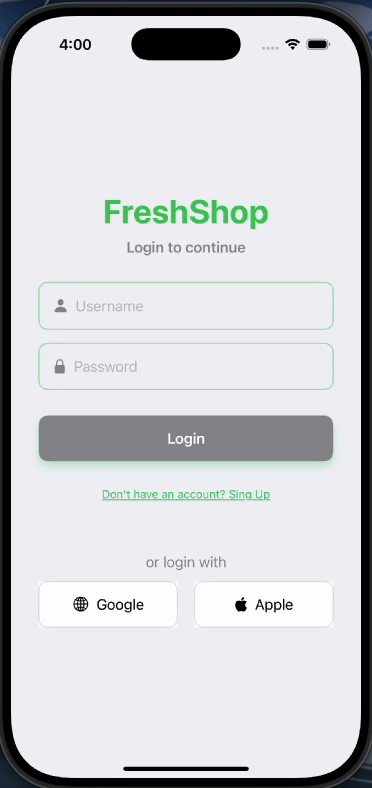
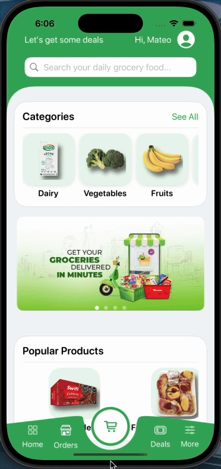
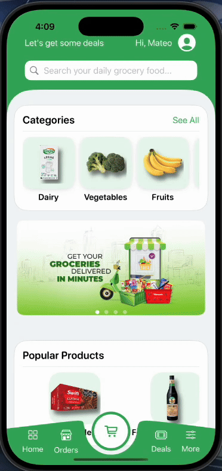
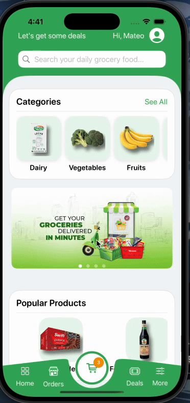
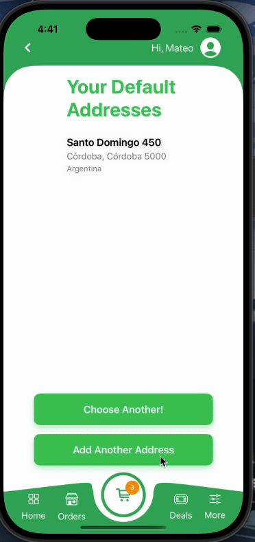
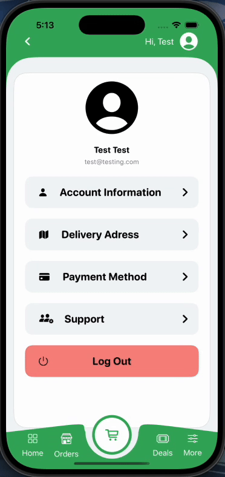
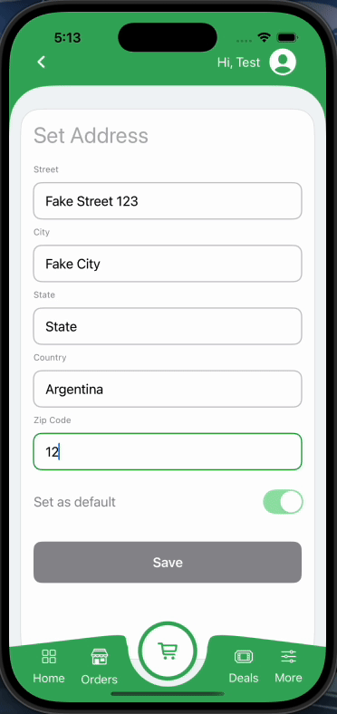
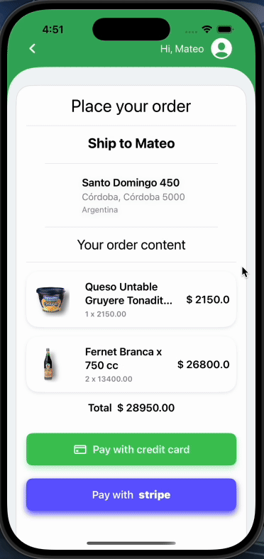
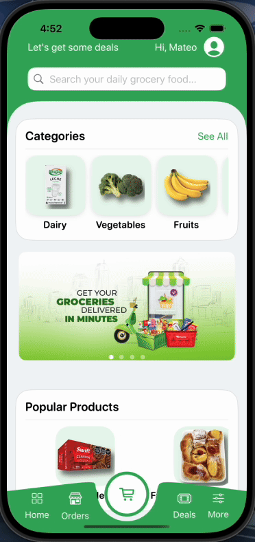
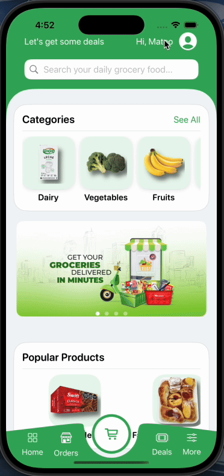

# 🛒 Vista previa de Freshop

**Freshop** es una app de e-commerce que estoy desarrollando con mucho cariño en **SwiftUI**.  
Aún estoy trabajando en el backend, pero ya tengo varias pantallas funcionando con animaciones fluidas que le dan vida a la experiencia de usuario.

Quiero compartir algunos avances del frontend para mostrar cómo va tomando forma 👇

---

## 🕰️ Versión inicial (abril 2025)

### 🏠 Pantalla de inicio  

### 📂 Categorías  

### 👤 Perfil del usuario 

### 🛍️ Detalle del producto  

### 📦 Órdenes  

### 🛒 Carrito  

---

## 🚀 Últimos avances (junio 2025)

🔗 **Versión funcional conectada al backend**  
El backend está disponible en el repo 👉 [FeshShopBack](https://github.com/Mapcky/FeshShopBack)

---

### 🔐 Registro y login con JWT  
El usuario puede crear una cuenta, iniciar sesión y acceder de forma segura con autenticación basada en JSON Web Token.  

  

---

### 🧭 Navegación entre categorías y detalle de producto  
Transición animada entre categorías y productos, con datos obtenidos dinámicamente desde el backend.

  

---

### 🏠 Gestión de direcciones del usuario  
Los usuarios pueden seleccionar una dirección predeterminada y añadir nuevas.

- **Elegir dirección predeterminada:**  

- **Añadir nueva dirección:**  

- **Flujo para usuarios nuevos sin direcciones previas:**  

---

### 💳 Métodos de pago  
Checkout funcional con dos opciones de pago:

- **Stripe:** Integración real con pasarela de pago segura.

- **Tarjeta de crédito personalizada:** Formulario con validaciones visuales y simulación de pago.

---

### 📦 Gestión de órdenes  
Visualización de órdenes reales del usuario conectadas al backend.  

---

### 🔓 Cierre de sesión  
Funcionalidad para cerrar sesión y limpiar el token de autenticación.  

