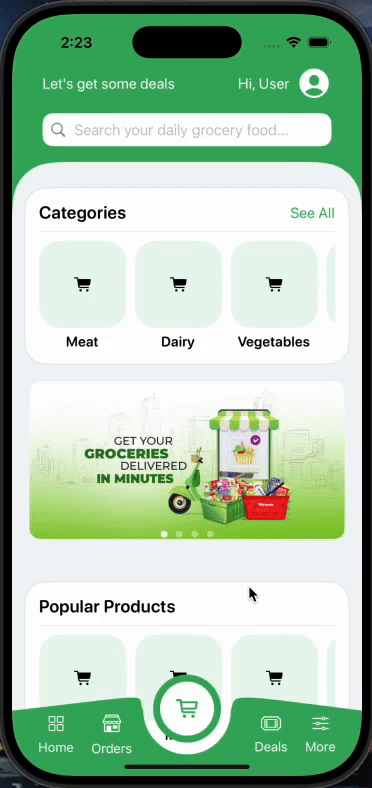
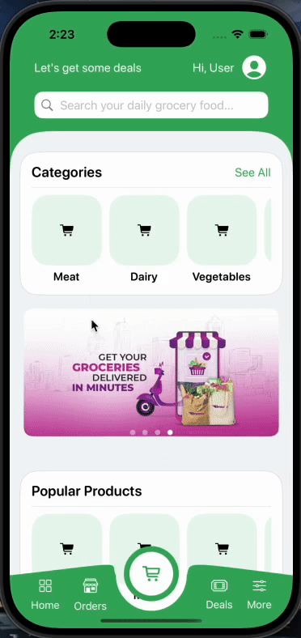
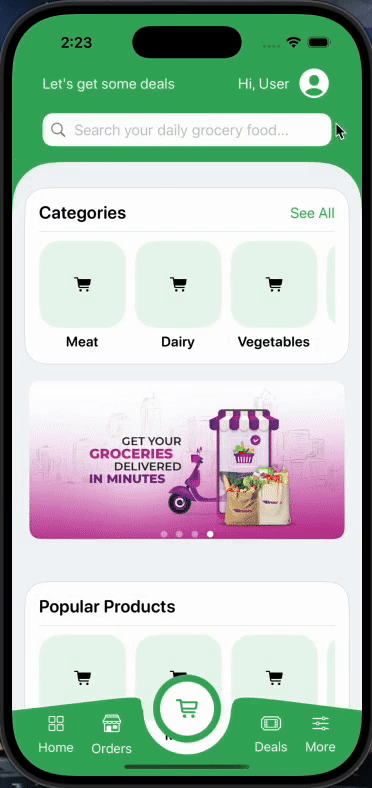
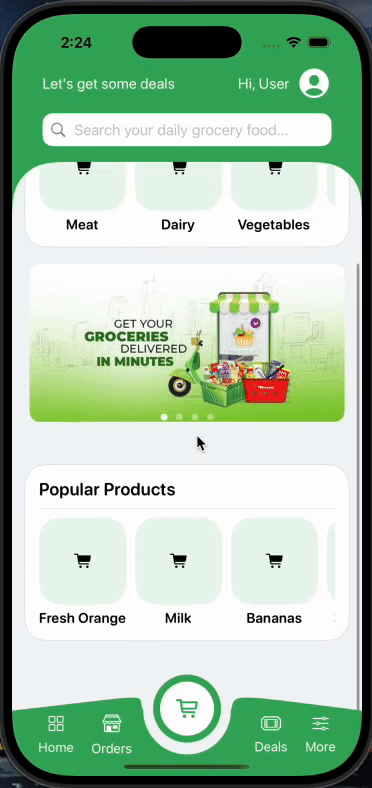
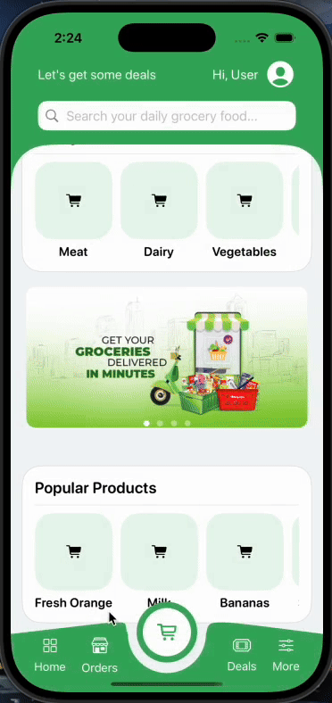
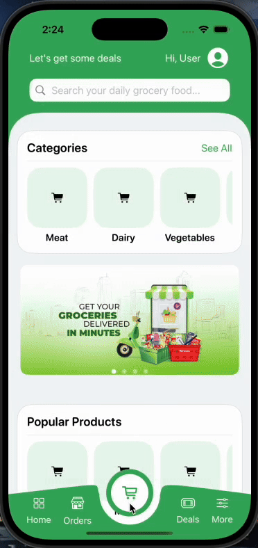

## 🛒 Vista previa de Freshop

Freshop es una app de e-commerce que estoy desarrollando con mucho cariño en SwiftUI. Aún estoy trabajando en el backend, pero ya tengo varias pantallas funcionando con animaciones fluidas que le dan vida a la experiencia de usuario.
Quiero compartir algunos avances del frontend para mostrar cómo va tomando forma 👇

🏠 Pantalla de inicio

📂 Categorías

👤 Perfil del usuario

🛍️ Detalle del producto

📦 Órdenes

🛒 Carrito

